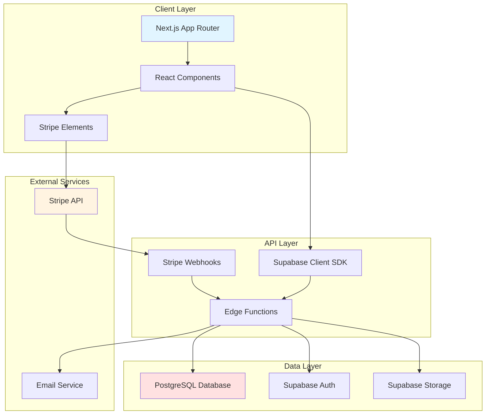
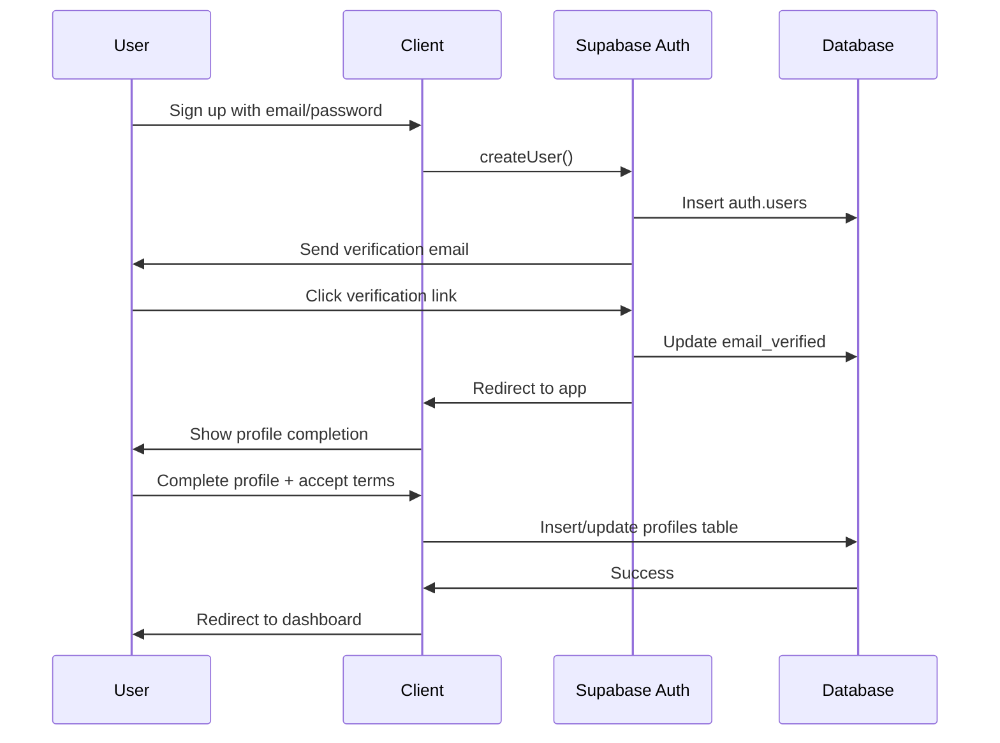
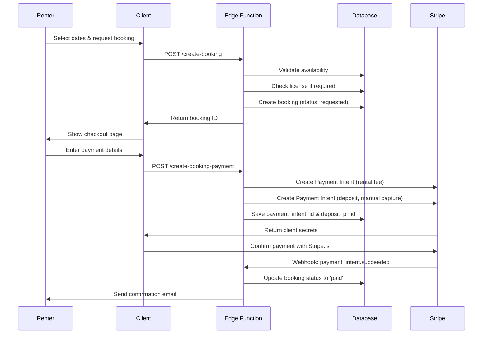
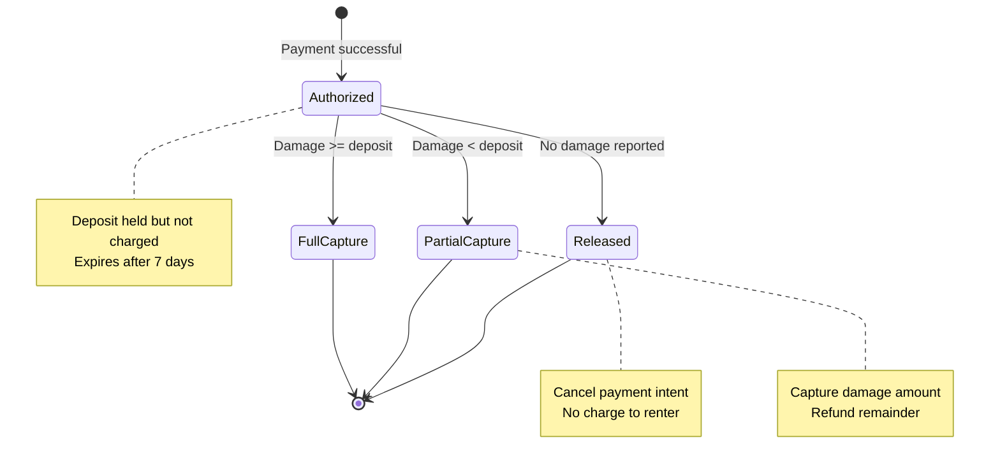

# Design Document

## Overview

Rentilia will be rebuilt as a modern Next.js 15 application with complete Supabase backend integration, replacing all Firebase dependencies. The architecture follows a clean separation between frontend (React/TypeScript), backend services (Supabase Edge Functions), and data layer (PostgreSQL with Row Level Security).

The system implements a complete peer-to-peer rental marketplace with sophisticated payment handling through Stripe, supporting the full rental lifecycle from item discovery through payment settlement and dispute resolution.

### Technology Stack

**Frontend:**
- Next.js 15.3.3 with App Router
- React 18.3.1 with TypeScript 5
- Tailwind CSS 3.4 + Shadcn/ui components
- React Hook Form + Zod for validation
- TanStack React Query for data fetching
- Stripe.js for payment UI

**Backend:**
- Supabase (PostgreSQL 15, Auth, Storage, Edge Functions)
- Stripe API for payment processing
- Deno runtime for Edge Functions

**Development:**
- Turbopack for fast development builds
- TypeScript strict mode
- ESLint + Prettier for code quality

## Architecture

### High-Level System Architecture



### Authentication Flow



### Payment and Booking Flow



### Deposit Management Flow



## Components and Interfaces

### Frontend Component Structure

```
src/
├── app/
│   ├── (auth)/
│   │   ├── login/page.tsx          # Login with Supabase Auth
│   │   └── signup/page.tsx         # Signup + email verification
│   ├── browse/page.tsx             # Item search and discovery
│   ├── listings/
│   │   ├── [id]/page.tsx           # Item detail view
│   │   └── new/page.tsx            # Multi-step item creation
│   ├── checkout/
│   │   └── [bookingId]/page.tsx    # Stripe payment integration
│   ├── dashboard/
│   │   ├── page.tsx                # User dashboard overview
│   │   ├── bookings/page.tsx       # Booking management
│   │   ├── listings/page.tsx       # Owner's items
│   │   └── profile/page.tsx        # Profile editing
│   └── messages/page.tsx           # In-app messaging
├── components/
│   ├── auth/
│   │   ├── AuthProvider.tsx        # Supabase auth context
│   │   ├── ProtectedRoute.tsx      # Route guards
│   │   └── ProfileCompletion.tsx   # First-time user flow
│   ├── booking/
│   │   ├── BookingForm.tsx         # Date picker + validation
│   │   ├── BookingCard.tsx         # Booking display
│   │   └── StatusBadge.tsx         # Visual status indicators
│   ├── payment/
│   │   ├── CheckoutForm.tsx        # Stripe Elements wrapper
│   │   ├── PaymentSummary.tsx      # Cost breakdown
│   │   └── DepositInfo.tsx         # Deposit explanation
│   ├── items/
│   │   ├── ItemForm.tsx            # Multi-step creation
│   │   ├── ItemCard.tsx            # Grid/list item display
│   │   ├── ItemFilters.tsx         # Search filters
│   │   └── PhotoUpload.tsx         # Supabase Storage upload
│   ├── messaging/
│   │   ├── MessageThread.tsx       # Conversation view
│   │   └── MessageInput.tsx        # Send message form
│   └── reviews/
│       ├── ReviewForm.tsx          # Rating + comment
│       └── ReviewList.tsx          # Display reviews
├── lib/
│   ├── supabase/
│   │   ├── client.ts               # Browser client
│   │   ├── server.ts               # Server-side client
│   │   └── types.ts                # Generated types
│   ├── stripe/
│   │   └── client.ts               # Stripe.js initialization
│   ├── hooks/
│   │   ├── useAuth.ts              # Auth state management
│   │   ├── useBookings.ts          # Booking queries
│   │   └── useItems.ts             # Item queries
│   └── utils/
│       ├── validation.ts           # Zod schemas
│       └── formatting.ts           # Date/currency helpers
└── types/
    └── database.ts                 # Supabase generated types
```

### Backend Edge Functions

```
supabase/functions/
├── create-booking/
│   └── index.ts                    # Validate and create booking
├── create-booking-payment/
│   └── index.ts                    # Create Stripe payment intents
├── stripe-webhook/
│   └── index.ts                    # Process Stripe events
├── manage-deposit/
│   └── index.ts                    # Release/capture deposits
├── confirm-pickup/
│   └── index.ts                    # Update booking status
├── confirm-return/
│   └── index.ts                    # Process return + deposit
├── send-message/
│   └── index.ts                    # Create message record
└── verify-license/
    └── index.ts                    # Admin license approval
```

### Key Interfaces and Types

```typescript
// Core domain types
interface Profile {
  id: string;
  full_name: string;
  email: string;
  phone?: string;
  bio?: string;
  avatar_url?: string;
  city?: string;
  state?: string;
  stripe_account_id?: string;
  terms_accepted: boolean;
  accepted_terms_version?: number;
  accepted_terms_at?: string;
  created_at: string;
  updated_at: string;
}

interface Item {
  id: string;
  owner_id: string;
  title: string;
  description?: string;
  category: string;
  price_per_day: number;
  replacement_value: number;
  deposit_amount: number;
  pickup_address: string;
  pickup_type: 'renter_pickup' | 'owner_delivery';
  is_license_required: boolean;
  min_rental_days: number;
  max_rental_days?: number;
  photo_urls: string[];
  is_available: boolean;
  created_at: string;
  updated_at: string;
}

type BookingStatus = 
  | 'pending'
  | 'requested'
  | 'paid'
  | 'picked_up'
  | 'returned_waiting_owner'
  | 'closed_no_damage'
  | 'deposit_captured'
  | 'cancelled';

interface Booking {
  id: string;
  item_id: string;
  renter_id: string;
  start_datetime: string;
  end_datetime: string;
  total_rental_fee: number;
  deposit_amount: number;
  status: BookingStatus;
  payment_intent_id?: string;
  deposit_pi_id?: string;
  pickup_confirmed_at?: string;
  return_confirmed_at?: string;
  refund_amount: number;
  rating?: number;
  return_photo_url?: string;
  created_at: string;
  updated_at: string;
}

interface Review {
  id: string;
  booking_id?: string;
  reviewer_id: string;
  reviewee_id: string;
  item_id?: string;
  rating: number;
  comment?: string;
  created_at: string;
}

interface License {
  id: string;
  user_id: string;
  license_type: string;
  document_url?: string;
  expiry_date?: string;
  is_verified: boolean;
  verified_at?: string;
  verified_by?: string;
  created_at: string;
}

interface Message {
  id: string;
  sender_id: string;
  recipient_id: string;
  booking_id?: string;
  content: string;
  is_read: boolean;
  created_at: string;
}

// API request/response types
interface CreateBookingRequest {
  item_id: string;
  start_datetime: string;
  end_datetime: string;
}

interface CreatePaymentRequest {
  booking_id: string;
}

interface CreatePaymentResponse {
  rental_client_secret: string;
  deposit_client_secret: string;
  rental_amount: number;
  deposit_amount: number;
}

interface ManageDepositRequest {
  booking_id: string;
  action: 'release' | 'capture';
  capture_amount?: number;
  damage_description?: string;
}
```

## Data Models

### Database Schema

The complete PostgreSQL schema is defined in the requirements document. Key design decisions:

**1. User Roles via Junction Table**
- Users can have multiple roles (renter, owner, admin)
- Implemented via `user_roles` table with unique constraint on (user_id, role)
- Allows flexible permission management

**2. Booking Status Enum**
- Enforces valid state transitions at database level
- Prevents invalid status values
- Makes queries more efficient with indexed enum

**3. Separate Payment Intent Tracking**
- `payment_intent_id` for rental fee (immediate capture)
- `deposit_pi_id` for security deposit (manual capture)
- Enables independent management of each payment

**4. Timestamp Tracking**
- `pickup_confirmed_at` and `return_confirmed_at` for audit trail
- `created_at` and `updated_at` on all tables
- Enables analytics and dispute resolution

**5. Photo Storage**
- `photo_urls` as TEXT[] array for items
- `return_photo_url` as single TEXT for return evidence
- Stores Supabase Storage URLs, not binary data

### Row Level Security Policies

```sql
-- Profiles: Public read, own update
CREATE POLICY "profiles_select" ON profiles
  FOR SELECT USING (true);

CREATE POLICY "profiles_update" ON profiles
  FOR UPDATE USING (auth.uid() = id);

-- Items: Public read, owner CRUD
CREATE POLICY "items_select" ON items
  FOR SELECT USING (is_available = true OR owner_id = auth.uid());

CREATE POLICY "items_insert" ON items
  FOR INSERT WITH CHECK (auth.uid() = owner_id);

CREATE POLICY "items_update" ON items
  FOR UPDATE USING (auth.uid() = owner_id);

CREATE POLICY "items_delete" ON items
  FOR DELETE USING (auth.uid() = owner_id);

-- Bookings: Participants can read, renter can create
CREATE POLICY "bookings_select" ON bookings
  FOR SELECT USING (
    auth.uid() = renter_id OR 
    auth.uid() IN (SELECT owner_id FROM items WHERE id = item_id)
  );

CREATE POLICY "bookings_insert" ON bookings
  FOR INSERT WITH CHECK (auth.uid() = renter_id);

-- Messages: Participants can read/write
CREATE POLICY "messages_select" ON messages
  FOR SELECT USING (
    auth.uid() = sender_id OR 
    auth.uid() = recipient_id
  );

CREATE POLICY "messages_insert" ON messages
  FOR INSERT WITH CHECK (auth.uid() = sender_id);

-- Reviews: Public read, reviewer can create
CREATE POLICY "reviews_select" ON reviews
  FOR SELECT USING (true);

CREATE POLICY "reviews_insert" ON reviews
  FOR INSERT WITH CHECK (auth.uid() = reviewer_id);

-- Licenses: Own read/write, admin read all
CREATE POLICY "licenses_select" ON licenses
  FOR SELECT USING (
    auth.uid() = user_id OR
    EXISTS (SELECT 1 FROM user_roles WHERE user_id = auth.uid() AND role = 'admin')
  );

CREATE POLICY "licenses_insert" ON licenses
  FOR INSERT WITH CHECK (auth.uid() = user_id);
```

### Database Indexes

```sql
-- Performance optimization indexes
CREATE INDEX idx_items_owner ON items(owner_id);
CREATE INDEX idx_items_category ON items(category);
CREATE INDEX idx_items_available ON items(is_available) WHERE is_available = true;
CREATE INDEX idx_bookings_renter ON bookings(renter_id);
CREATE INDEX idx_bookings_item ON bookings(item_id);
CREATE INDEX idx_bookings_status ON bookings(status);
CREATE INDEX idx_messages_recipient ON messages(recipient_id) WHERE is_read = false;
CREATE INDEX idx_reviews_reviewee ON reviews(reviewee_id);
CREATE INDEX idx_reviews_item ON reviews(item_id);
```

## Error Handling

### Error Classification

**1. Validation Errors (400)**
- Invalid input data (Zod validation failures)
- Business rule violations (min rental days, license required)
- Display field-level errors to user

**2. Authentication Errors (401)**
- Missing or invalid JWT token
- Expired session
- Redirect to login page

**3. Authorization Errors (403)**
- User lacks required role
- Attempting to access another user's data
- Display "Access denied" message

**4. Not Found Errors (404)**
- Resource doesn't exist
- Display helpful "not found" page

**5. Payment Errors (402)**
- Card declined
- Insufficient funds
- Display Stripe error message + retry option

**6. Server Errors (500)**
- Database connection failures
- Stripe API errors
- Log error details, show generic message to user

### Error Handling Strategy

```typescript
// Frontend error boundary
class ErrorBoundary extends React.Component {
  componentDidCatch(error: Error, errorInfo: React.ErrorInfo) {
    // Log to error tracking service
    console.error('Error boundary caught:', error, errorInfo);
    
    // Show user-friendly error UI
    this.setState({ hasError: true });
  }
}

// API error handling
async function handleApiError(error: unknown) {
  if (error instanceof PostgrestError) {
    // Database error
    if (error.code === '23505') {
      return { error: 'This record already exists' };
    }
    return { error: 'Database error occurred' };
  }
  
  if (error instanceof AuthError) {
    // Redirect to login
    router.push('/login');
    return;
  }
  
  // Generic error
  return { error: 'Something went wrong. Please try again.' };
}

// Payment error handling
function handleStripeError(error: StripeError) {
  switch (error.type) {
    case 'card_error':
      return error.message; // Show Stripe's message
    case 'validation_error':
      return 'Please check your payment details';
    case 'api_error':
      return 'Payment service unavailable. Please try again later.';
    default:
      return 'Payment failed. Please try again.';
  }
}
```

### Retry Logic

```typescript
// Exponential backoff for transient failures
async function retryWithBackoff<T>(
  fn: () => Promise<T>,
  maxRetries = 3,
  baseDelay = 1000
): Promise<T> {
  for (let i = 0; i < maxRetries; i++) {
    try {
      return await fn();
    } catch (error) {
      if (i === maxRetries - 1) throw error;
      
      const delay = baseDelay * Math.pow(2, i);
      await new Promise(resolve => setTimeout(resolve, delay));
    }
  }
  throw new Error('Max retries exceeded');
}
```

## Testing Strategy

### Unit Testing

**Tools:** Vitest + React Testing Library

**Coverage targets:**
- Utility functions: 100%
- Validation schemas: 100%
- React hooks: 90%
- Components: 80%

**Key test areas:**
```typescript
// Validation logic
describe('bookingValidation', () => {
  it('should reject bookings shorter than min_rental_days', () => {
    const result = validateBookingDates(item, startDate, endDate);
    expect(result.valid).toBe(false);
  });
  
  it('should require license for licensed equipment', () => {
    const result = validateLicenseRequirement(item, user);
    expect(result.valid).toBe(false);
  });
});

// Date calculations
describe('calculateRentalFee', () => {
  it('should calculate correct fee for multi-day rental', () => {
    const fee = calculateRentalFee(pricePerDay, startDate, endDate);
    expect(fee).toBe(expectedAmount);
  });
});

// Component rendering
describe('ItemCard', () => {
  it('should display license required badge', () => {
    render(<ItemCard item={licensedItem} />);
    expect(screen.getByText('License Required')).toBeInTheDocument();
  });
});
```

### Integration Testing

**Tools:** Playwright for E2E tests

**Critical user journeys:**
1. Complete signup → profile completion → browse items
2. Create item listing → upload photos → publish
3. Search items → view details → request booking
4. Complete payment → receive confirmation
5. Confirm pickup → confirm return → receive deposit refund

**Test environment:**
- Supabase local development setup
- Stripe test mode with test cards
- Seeded test data

### Payment Testing

**Stripe test cards:**
```typescript
const TEST_CARDS = {
  success: '4242424242424242',
  decline: '4000000000000002',
  insufficientFunds: '4000000000009995',
  requiresAuth: '4000002500003155',
};

describe('Payment flow', () => {
  it('should handle successful payment', async () => {
    await fillPaymentForm(TEST_CARDS.success);
    await clickPayButton();
    expect(await getBookingStatus()).toBe('paid');
  });
  
  it('should handle declined card', async () => {
    await fillPaymentForm(TEST_CARDS.decline);
    await clickPayButton();
    expect(await getErrorMessage()).toContain('declined');
  });
});
```

### Performance Testing

**Metrics to monitor:**
- Page load time < 2 seconds
- Time to Interactive < 3 seconds
- First Contentful Paint < 1 second
- Lighthouse score > 90

**Load testing:**
- Simulate 30 concurrent users
- Test database query performance
- Monitor Edge Function cold starts

## Security Considerations

### Authentication Security

1. **Email verification required** before account activation
2. **Password requirements:** Minimum 8 characters, enforced by Supabase Auth
3. **Session management:** JWT tokens with automatic refresh
4. **Rate limiting:** Prevent brute force attacks on login

### Payment Security

1. **PCI compliance:** Never store card details (handled by Stripe)
2. **Webhook signature verification:** Validate all Stripe webhooks
3. **Idempotency keys:** Prevent duplicate charges
4. **Amount validation:** Server-side verification of all payment amounts

### Data Security

1. **Row Level Security:** Enforced on all tables
2. **Input sanitization:** Zod validation on all user inputs
3. **SQL injection prevention:** Parameterized queries via Supabase client
4. **XSS prevention:** React's built-in escaping + Content Security Policy

### File Upload Security

1. **File type validation:** Only allow images (JPEG, PNG, WebP)
2. **File size limits:** Maximum 5MB per image
3. **Virus scanning:** Supabase Storage built-in scanning
4. **Access control:** Signed URLs for private files

### API Security

1. **CORS configuration:** Restrict to production domain
2. **Rate limiting:** Prevent API abuse
3. **Request validation:** Validate all inputs in Edge Functions
4. **Error messages:** Don't leak sensitive information

## Performance Optimization

### Frontend Optimization

1. **Code splitting:** Dynamic imports for routes
2. **Image optimization:** Next.js Image component with WebP
3. **Lazy loading:** Defer non-critical components
4. **Bundle size:** Tree shaking and minification
5. **Caching:** React Query for data caching

```typescript
// Example: Lazy load heavy components
const ItemForm = dynamic(() => import('@/components/items/ItemForm'), {
  loading: () => <Skeleton />,
  ssr: false,
});

// Example: Optimized image loading
<Image
  src={item.photo_urls[0]}
  alt={item.title}
  width={400}
  height={300}
  loading="lazy"
  placeholder="blur"
/>
```

### Database Optimization

1. **Indexes:** On frequently queried columns
2. **Query optimization:** Use select() to fetch only needed columns
3. **Pagination:** Limit results with range()
4. **Connection pooling:** Supabase handles automatically

```typescript
// Example: Optimized query
const { data } = await supabase
  .from('items')
  .select('id, title, price_per_day, photo_urls, owner:profiles(full_name)')
  .eq('is_available', true)
  .eq('category', category)
  .range(0, 19) // First 20 items
  .order('created_at', { ascending: false });
```

### Edge Function Optimization

1. **Cold start reduction:** Keep functions warm with scheduled pings
2. **Minimal dependencies:** Reduce bundle size
3. **Connection reuse:** Reuse database connections
4. **Async operations:** Use Promise.all for parallel operations

## Deployment Strategy

### Environment Setup

**Development:**
```env
NEXT_PUBLIC_SUPABASE_URL=http://localhost:54321
NEXT_PUBLIC_SUPABASE_ANON_KEY=local_anon_key
NEXT_PUBLIC_STRIPE_PUBLISHABLE_KEY=pk_test_...
STRIPE_SECRET_KEY=sk_test_...
STRIPE_WEBHOOK_SECRET=whsec_test_...
```

**Production:**
```env
NEXT_PUBLIC_SUPABASE_URL=https://your-project.supabase.co
NEXT_PUBLIC_SUPABASE_ANON_KEY=production_anon_key
NEXT_PUBLIC_STRIPE_PUBLISHABLE_KEY=pk_live_...
STRIPE_SECRET_KEY=sk_live_...
STRIPE_WEBHOOK_SECRET=whsec_live_...
```

### Deployment Pipeline

1. **Local development:** `npm run dev` with Supabase local
2. **Staging:** Deploy to Vercel preview with staging Supabase project
3. **Production:** Deploy to Vercel production with production Supabase project

### Database Migrations

```bash
# Create migration
supabase migration new add_new_feature

# Apply locally
supabase db reset

# Apply to production
supabase db push
```

### Monitoring and Logging

1. **Error tracking:** Sentry for frontend errors
2. **Performance monitoring:** Vercel Analytics
3. **Database monitoring:** Supabase dashboard
4. **Payment monitoring:** Stripe dashboard
5. **Custom logging:** Edge Function logs in Supabase

## Migration Execution Plan

### Phase 1: Foundation (Days 1-3)

1. **Remove Firebase dependencies**
   - Uninstall all Firebase packages
   - Remove Firebase configuration files
   - Update environment variables

2. **Install Supabase stack**
   - Install Supabase client libraries
   - Install Stripe libraries
   - Set up Supabase project

3. **Database setup**
   - Run schema SQL in Supabase
   - Configure RLS policies
   - Create storage buckets

### Phase 2: Authentication (Days 4-5)

1. **Implement Supabase Auth**
   - Create AuthProvider component
   - Build login/signup pages
   - Add email verification flow
   - Implement protected routes

2. **Profile management**
   - Profile completion flow
   - Terms acceptance
   - Profile editing

### Phase 3: Core Features (Days 6-10)

1. **Item management**
   - Item creation form
   - Photo upload to Supabase Storage
   - Item listing page
   - Item detail page

2. **Search and browse**
   - Browse page with filters
   - Search functionality
   - Category filtering

3. **Booking system**
   - Booking request form
   - Date validation
   - License checking

### Phase 4: Payment Integration (Days 11-14)

1. **Stripe setup**
   - Create payment Edge Functions
   - Implement Stripe Elements
   - Build checkout page
   - Test payment flow

2. **Webhook handling**
   - Implement webhook endpoint
   - Process payment events
   - Update booking statuses

3. **Deposit management**
   - Implement deposit Edge Functions
   - Build return confirmation UI
   - Test deposit release/capture

### Phase 5: Polish (Days 15-17)

1. **Messaging system**
2. **Review system**
3. **Mobile optimization**
4. **Error handling improvements**
5. **Performance optimization**

### Phase 6: Testing & Launch (Days 18-21)

1. **Comprehensive testing**
2. **Beta user onboarding**
3. **Production deployment**
4. **Monitoring setup**

## Design Decisions and Rationales

### Why Next.js App Router?

- Server components for better performance
- Built-in API routes (though we use Edge Functions)
- Excellent TypeScript support
- Image optimization out of the box
- Easy deployment to Vercel

### Why Supabase over Firebase?

- PostgreSQL provides better data integrity with foreign keys and constraints
- Row Level Security is more powerful than Firestore rules
- Edge Functions use standard Deno/TypeScript (vs Firebase's proprietary runtime)
- Better pricing model for growing applications
- Open source with self-hosting option

### Why Separate Payment Intents?

- Rental fee needs immediate capture
- Deposit needs manual capture (only if damage occurs)
- Stripe recommends separate intents for different capture methods
- Easier to track and reconcile payments

### Why Edge Functions vs API Routes?

- Edge Functions run closer to users (lower latency)
- Direct database access without additional API layer
- Better security with server-side validation
- Consistent runtime environment (Deno)

### Why React Query?

- Automatic caching and refetching
- Optimistic updates for better UX
- Built-in loading and error states
- Reduces boilerplate code

## Success Metrics

### Technical Metrics

- Zero Firebase dependencies in package.json
- All tests passing (>80% coverage)
- Lighthouse score >90
- Page load time <2 seconds
- Zero security vulnerabilities

### Business Metrics

- 30 active beta users
- 50+ completed bookings
- 95%+ payment success rate
- <5% booking cancellation rate
- Average 4.5+ star rating

### User Experience Metrics

- <3 clicks to create listing
- <5 clicks to complete booking
- <10 seconds to complete payment
- 100% mobile responsive
- <1% error rate on critical flows
